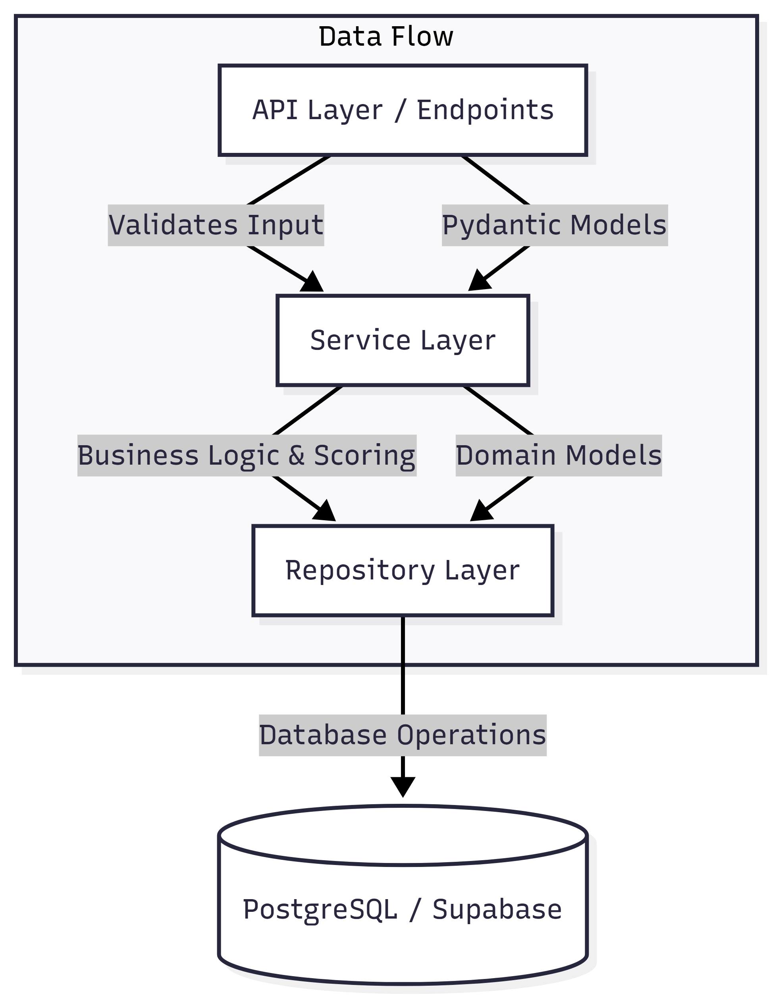
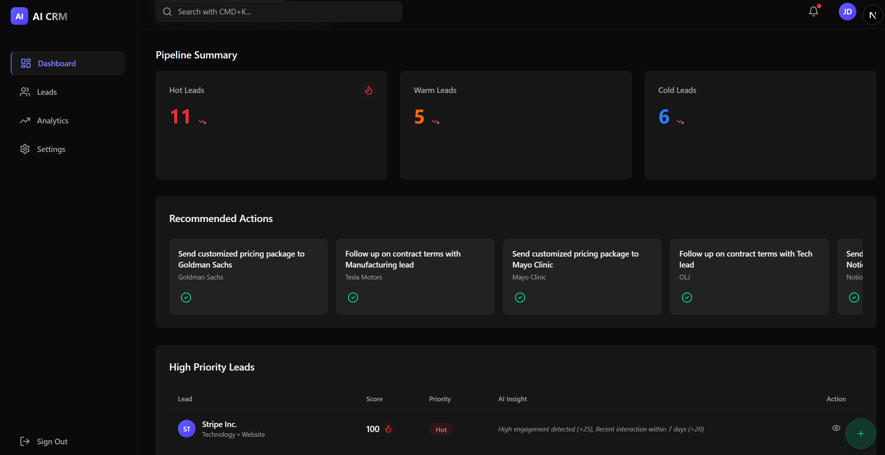
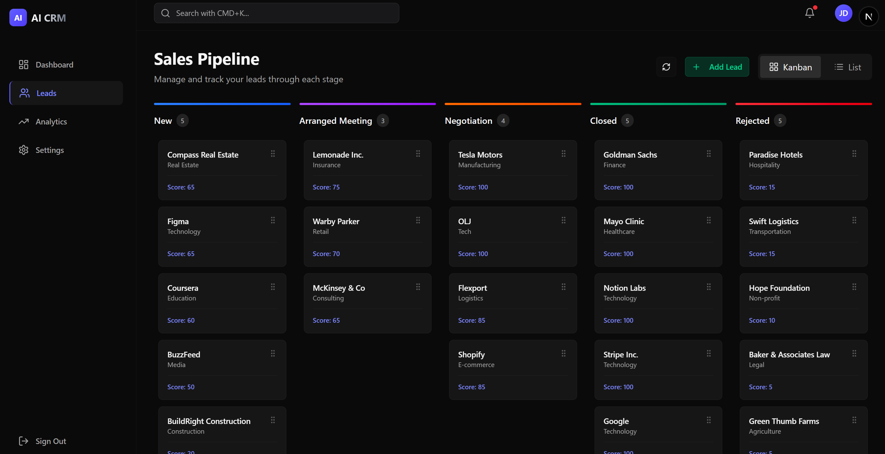
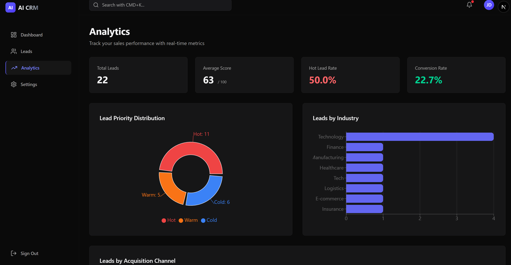

# AI-Powered CRM: Intelligent Lead Scoring & Sales Workspace

> **A modern Customer Relationship Management platform designed to help sales teams prioritize high-value leads through intelligent scoring and automated insights.**

## 🚀 Live Demo & Deployment
**This project is deployed and production-ready.**
[View Live Demo](https://ai-crm-olj.vercel.app/)

---

## 🏗️ Architecture & Tech Stack

### 🔄 System Workflow
The system follows a modern client-server architecture designed for real-time responsiveness and data integrity:

1.  **User Interaction**: Sales reps interact with the **Next.js Frontend**, which provides a responsive "app-like" experience.
2.  **API Requests**: The frontend communicates with the **FastAPI Backend** via RESTful endpoints (using custom React hooks).
3.  **Business Logic Processing**: The backend routes requests through a layered architecture—validating data with **Pydantic Models**, processing rules in **Services**, and handling data persistence in **Repositories**.
4.  **Data Persistence**: Validated data is stored in **Supabase (PostgreSQL)**, ensuring ACID compliance and scalability.

### 💻 Technology Stack

*   **Frontend**: Next.js (TypeScript), Tailwind CSS, Shadcn UI
*   **Backend**: Python 3.10+, FastAPI
*   **Database**: PostgreSQL (via Supabase)
*   **State Management**: Custom React Hooks

**Key Technology Decisions:**

*   **Why Next.js?** I chose Next.js to leverage Server-Side Rendering (SSR) for initial load performance and SEO, while maintaining a rich client-side interactivity essential for a dashboard application.
*   **Why PostgreSQL vs SQLite?** Instead of a simple local file database like SQLite, I implemented PostgreSQL (via Supabase) to mimic a real-world **production environment**. This ensures better concurrency, data integrity constraints, and scalability for a multi-user CRM system.

### 📐 Scalable Backend Architecture

We implemented a **Layered Architecture** (Service-Repository Pattern) to separate concerns and ensure the codebase is maintainable and scalable.



*   **API Layer (`endpoints/`)**: Handles HTTP requests/responses and input validation.
*   **Service Layer (`services/`)**: Contains pure business logic (e.g., Lead Scoring Engine). It doesn't know about HTTP or SQL.
*   **Repository Layer (`repositories/`)**: Abstraction for data access. If we switch databases later, we only change this layer.
*   **Models (`schemas.py`)**: Strong typing ensures data consistency across all layers.

---

## 🧠 Lead Scoring Engine

The core of this CRM is its **Intelligent Scoring Engine**. Instead of treating all leads equally, we analytically score them from **0-100** to help sales reps focus on who matters *now*.

### The Logic: Maximizing ROI per Interaction

Our scoring algorithm isn't just arbitrary points—it's designed to **optimize sales time**. We score based on two pillars: **Engagement** (how much they interact) and **Intent** (what they are looking for).

| Signal | Points | Strategic Business Value |
|--------|--------|--------------------------|
| **Pricing Request** | **+30** | **Capture Demand at Peak Intent:** A prospect checking pricing is evaluating feasibility. Prioritizing these leads prevents competitors from swooping in during the critical consideration phase. |
| **Recency** | **+20** | **Accelerate Sales Velocity:** Time kills deals. A lead active *today* is 10x more likely to convert than one from last week. We heavily weight recency to ensure no hot lead goes cold. |
| **Demo Request** | **+15** | **Qualify Interest:** A demo request signals a deeper commitment to evaluate the solution, moving the prospect from "Awareness" to "Consideration" in the funnel. |
| **Company Size** | **+10** | **Target High ACV:** Larger organizations (>50 employees) typically represent higher Annual Contract Value (ACV) and expansion potential. |
| **Engagement** | **+5** | **Validate Interest:** Capped at 25 points. Consistent interaction verifies interest, but we cap it to ensure "tire kickers" don't distract reps from leads with genuine purchasing intent. |

### Priority Tiers: Focusing Effort
*   **🔴 Hot (70-100):** **Immediate Action.** These leads are in the "Buying Zone". Call within 1 hour to maximize conversion rates.
*   **🟠 Warm (40-69):** **Nurture.** Interested but not ready. Enrol in automated email sequences to keep your brand top-of-mind.
*   **🔵 Cold (0-39):** **Long-term.** Low priority. Don't spend active sales time here; let marketing automation handle re-engagement.

---

## 🤖 AI Strategy: From Reactive to Predictive

We built the system with the **Strategy Pattern** not just for code cleanliness, but to enable a **strategic evolution** of our intelligence capabilities without technical debt.

### Phase 1: Transparent Rules (Current)
We start with a deterministic `RuleBasedScoringEngine`.
*   **Business Value**: Complete transparency. Sales reps trust the score because they can see exactly *why* a lead is hot (e.g., "Score +30 due to Pricing Request"). This builds adoption.

### Phase 2: Predictive Intelligence (Future)
The architecture supports hot-swapping in an `AIScoringEngine` to move from *describing* value to *predicting* it.

**Planned Strategic Capabilities:**
1.  **Conversion Probability Modeling**: Train an XGBoost model on historical "Closed-Won" data to identify non-obvious buying signals (e.g., "Leads from LinkedIn who read 2 case studies are 4x more likely to close").
2.  **Churn Risk Detection**: Use Sentiment Analysis on email communications to flag at-risk deals *before* they go cold.
3.  **Next-Best-Action Engine**: Instead of generic follow-ups, the AI will prescribe the specific content (Case Study vs. Whitepaper) most likely to nudge a specific lead forward.

---

## 🚀 Getting Started

### Prerequisites
- **Node.js 18+**
- **Python 3.10+**
- **Supabase Account** (Free tier is sufficient)

### 1. Database Setup (Supabase)
1.  Create a new project in Supabase.
2.  Go to the **SQL Editor** and run the query found in `backend/scripts/create_table.sql`.
    *   *This script sets up the `leads` table, Row Level Security (RLS) policies, and all necessary constraints.*
3.  Get your `SUPABASE_URL` and `SUPABASE_KEY` from Project Settings > API.

### 2. Backend Setup
```bash
cd backend

# Create & activate virtual environment
python -m venv venv
.\venv\Scripts\Activate.ps1   # Windows PowerShell
# source venv/bin/activate    # macOS/Linux

# Install dependencies
pip install -r requirements.txt

# Environment Config
cp .env.example .env
# Open .env and paste your SUPABASE_URL and SUPABASE_KEY

# Start the API Server
uvicorn app.main:app --reload
```
*The API will run at `http://localhost:8000`*

### 3. Frontend Setup
```bash
cd frontend

# Install dependencies
npm install

# Environment Config
cp .env.example .env
# Open .env and set your API URL (default provided is local):
# NEXT_PUBLIC_API_URL=http://localhost:8000/api/v1 (or your production URL)

# Start the Development Server
npm run dev
```
*The App will run at `http://localhost:3000`*

---

## 🏢 Sales Workspace Features

### 1. The Command Center (Dashboard)


The **Dashboard** is designed to **minimize cognitive load**. Instead of overwhelming reps with raw data, it answers the question: *"What should I do right now?"*
- **Action Queue**: An AI-driven "To-Do" list that prioritizes tasks based on lead score and urgency.
- **Pipeline Health**: Immediate visual feedback on pipeline volume to prevent dry spells.

### 2. Pipeline Management (Leads)


Visualizing the sales funnel to **increase deal velocity**:
- **Drag-and-Drop Workflow**: Intuitive movement reduces friction in updating deal status, ensuring data accuracy.
- **Visual Stagnation Checks**: Quickly identify leads stuck in "Negotiation" or "Meeting" to unblock revenue.
- **One-Click Context**: Instant access to lead scoring details prevents "blind" outreach.

### 3. Data Insights (Analytics)


Turning raw activity into **strategic direction**:
- **Source ROI**: Identify which channels (e.g., LinkedIn vs. Website) produce the highest *quality* leads, not just the highest volume.
- **Priority Distribution**: Monitor the ratio of "Hot" vs. "Cold" leads to predict future revenue gaps.

---
